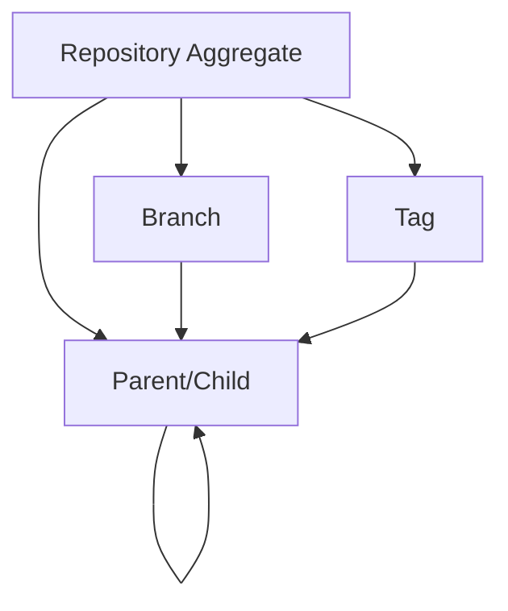
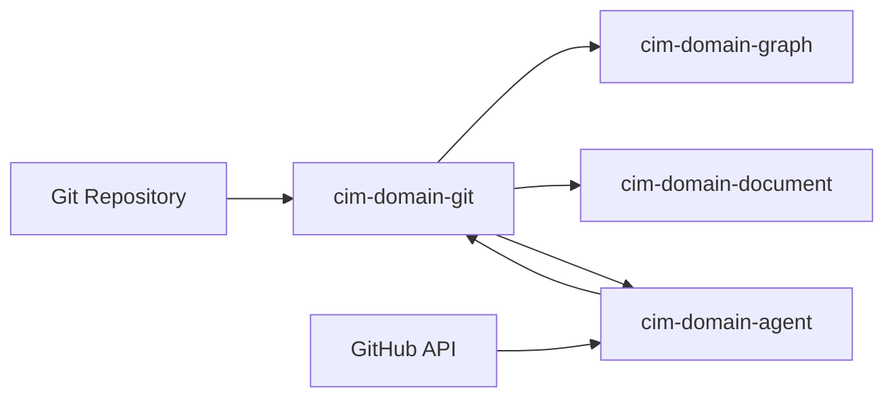

<!-- Copyright 2025 Cowboy AI, LLC. -->

# Git Domain Design

## Overview

The Git domain module provides comprehensive Git repository introspection and graph extraction capabilities for the CIM architecture. It serves as the bridge between Git repositories and the CIM graph-based knowledge representation system.

## Core Concepts

### Domain Model



### Integration Architecture



## Key Features

### 1. Repository Analysis
- Clone and manage Git repositories
- Extract commit history and metadata
- Analyze branch relationships
- Track file changes over time

### 2. Graph Extraction
- Convert commit history to directed graphs
- Map branch merge relationships
- Extract file dependency graphs
- Visualize repository evolution

### 3. GitHub Integration
- Connect to GitHub via MCP (Model Context Protocol)
- Sync issues, PRs, and releases
- Extract workflow definitions
- Analyze repository metadata

### 4. Configuration Mining
- Extract deployment configurations
- Identify infrastructure as code
- Parse CI/CD definitions
- Map configuration dependencies

## Domain Events

### Repository Lifecycle
- `RepositoryCloned`: Repository successfully cloned
- `RepositoryUpdated`: Repository fetched new changes
- `RepositoryAnalyzed`: Repository analysis completed

### Commit Analysis
- `CommitAnalyzed`: Individual commit processed
- `CommitGraphExtracted`: Commit relationships mapped
- `MergeDetected`: Merge commit identified

### File Analysis
- `FileAnalyzed`: File metrics extracted
- `DependencyGraphExtracted`: Dependencies mapped
- `FileHistoryTracked`: File evolution tracked

## Command Patterns

### Repository Commands
```rust
CloneRepository {
    remote_url: RemoteUrl,
    local_path: String,
    branch: Option<BranchName>,
}

AnalyzeRepository {
    repository_id: RepositoryId,
    analyze_languages: bool,
    calculate_statistics: bool,
}
```

### Graph Extraction Commands
```rust
ExtractCommitGraph {
    repository_id: RepositoryId,
    include_all_branches: bool,
    include_tags: bool,
}

ExtractDependencyGraph {
    repository_id: RepositoryId,
    language: Option<String>,
}
```

## Integration Points

### With cim-domain-graph
- Converts Git structures to graph nodes and edges
- Preserves commit parent-child relationships
- Maps branch merge points
- Enables graph-based queries on Git data

### With cim-domain-document
- Extracts README and documentation files
- Processes configuration files
- Identifies deployment manifests
- Links documentation to code changes

### With cim-domain-agent
- Enables AI agents to interact with Git repositories
- Provides GitHub API access via MCP
- Supports automated repository analysis
- Facilitates code understanding tasks

## Implementation Strategy

### Phase 1: Core Git Operations
- [x] Domain model (aggregates, value objects)
- [x] Basic commands and events
- [ ] Git operations using git2-rs
- [ ] Repository cloning and fetching

### Phase 2: Analysis Features
- [ ] Commit history extraction
- [ ] Branch relationship mapping
- [ ] File change tracking
- [ ] Basic statistics generation

### Phase 3: Graph Integration
- [ ] Commit graph generation
- [ ] Dependency analysis
- [ ] Graph domain integration
- [ ] Visualization support

### Phase 4: Advanced Features
- [ ] GitHub MCP integration
- [ ] Configuration mining
- [ ] Language-specific analysis
- [ ] Performance optimization

## Technical Considerations

### Performance
- Use shallow clones for large repositories
- Implement incremental analysis
- Cache analysis results
- Stream large datasets

### Storage
- Store repository metadata in projections
- Use CID for content addressing
- Implement garbage collection
- Support repository archival

### Security
- Validate remote URLs
- Sanitize file paths
- Handle authentication securely
- Respect repository permissions

## Future Enhancements

1. **Multi-Repository Analysis**
   - Cross-repository dependency tracking
   - Organization-wide insights
   - Repository clustering

2. **Advanced Git Features**
   - Submodule support
   - Git LFS handling
   - Worktree management

3. **AI Integration**
   - Code understanding via LLMs
   - Automated PR analysis
   - Commit message generation

4. **Visualization**
   - 3D commit graphs
   - Interactive branch exploration
   - Time-based animations 